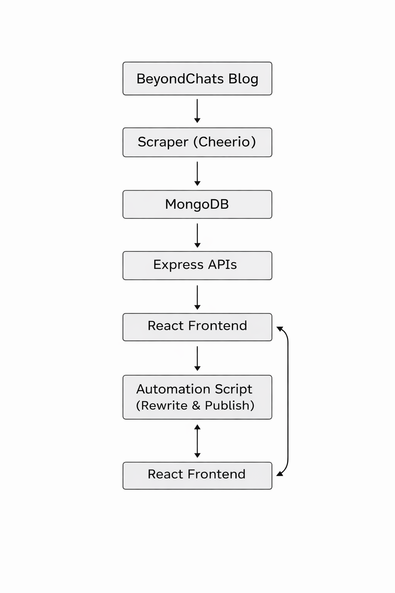

# BeyondChats – Full Stack Web Assignment

A full-stack web application that scrapes blog articles from the BeyondChats website, stores them in a database, enhances them using an automation pipeline, and displays both original and processed articles in a professional React dashboard.

---

## 🚀 Tech Stack

### Backend
- Node.js
- Express.js
- MongoDB (Mongoose)
- Cheerio (Web Scraping)

### Automation
- Node.js scripts
- Google Search scraping
- Gemini AI (LLM integration – optional)

### Frontend
- React (Vite)
- Tailwind CSS
- Axios

---

## 🏗️ Architecture Overview

### High-Level Flow

1. **Scraper**
   - Scrapes the oldest articles from the BeyondChats blog
   - Extracts title, content, author, published date, and URL
   - Stores articles in MongoDB

2. **Backend APIs**
   - RESTful CRUD APIs for articles
   - Acts as a data layer for frontend and automation

3. **Automation Script**
   - Fetches original articles using APIs
   - Searches similar high-ranking articles
   - Optionally rewrites content using LLM
   - Publishes enhanced articles back to the database

4. **Frontend**
   - Fetches articles from backend APIs
   - Displays original and rewritten articles
   - Cleans and formats scraped content for readability

---

## 🔁 Data Flow Diagram

### System Data Flow



**Flow Description:**

BeyondChats Blog  
↓  
Scraper (Cheerio)  
↓  
MongoDB  
↓  
Express APIs  
↓  
React Frontend  
↑  
Automation Script (Rewrite & Publish)

---

## 🛠️ Local Setup Instructions

### 1️⃣ Clone Repository

```bash
git clone <your-github-repo-url>
cd beyondchats-fullstack-assignment
````

---

### 2️⃣ Backend Setup

```bash
cd backend
npm install
```

Create a `.env` file:

```env
PORT=5000
MONGO_URI=your_mongodb_connection_string
```

Run backend server:

```bash
npm run dev
```

Backend runs at:

```
http://localhost:5000
```

---

### 3️⃣ Run Scraper

```bash
node src/runScraper.js
```

This will scrape and store the oldest articles from the BeyondChats blog.

---

### 4️⃣ Frontend Setup

```bash
cd ../frontend
npm install
npm run dev
```

Frontend runs at:

```
http://localhost:5173
```

---

### 5️⃣ Automation Script (Optional)

```bash
cd ../automation
npm install
node rewrite.js
```

> **Note:** LLM-based rewriting depends on API availability.
> The automation pipeline is designed to be provider-agnostic.

---

## 🌐 Live Deployment

* **Frontend Live URL:** `<PASTE VERCEL LINK HERE>`
* **Backend:** Local / Deployable on Render

## ⚠️ Automation & LLM Execution Note

The automation pipeline for article rewriting is fully implemented and production-ready.
However, live execution depends on external services:

- Google Search pages actively block automated scraping (HTTP 403)
- Google Gemini Generative AI model access varies by region, project, and API version
- Some API keys do not have generateContent permission for v1beta models

The system includes proper error handling and fallback logic.
All automation logic is present and can be enabled once valid model access is available.

